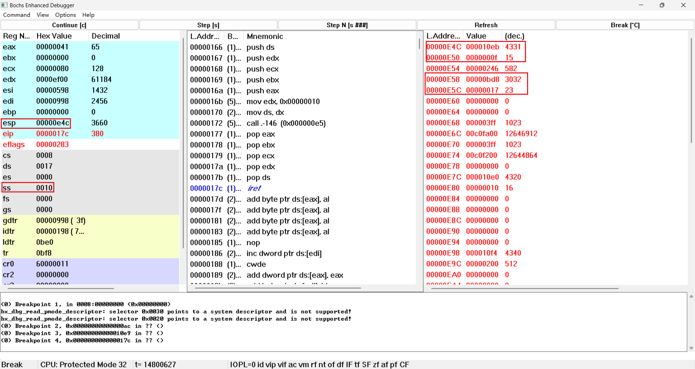
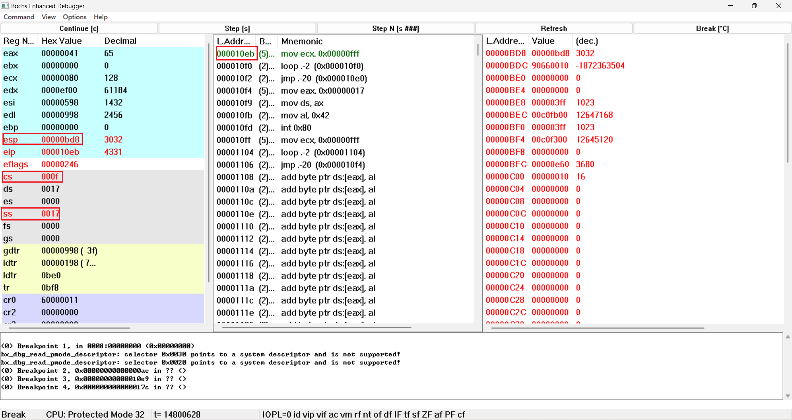
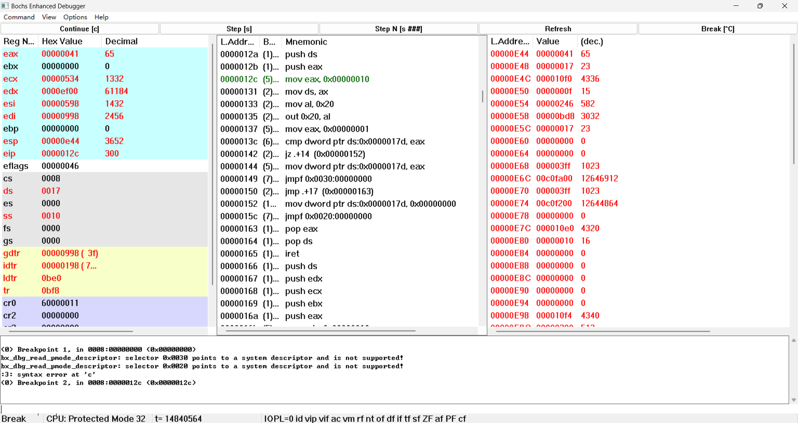
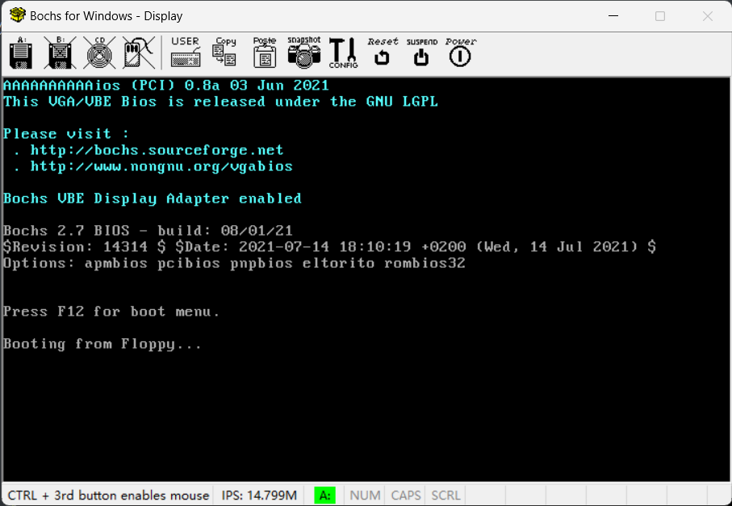
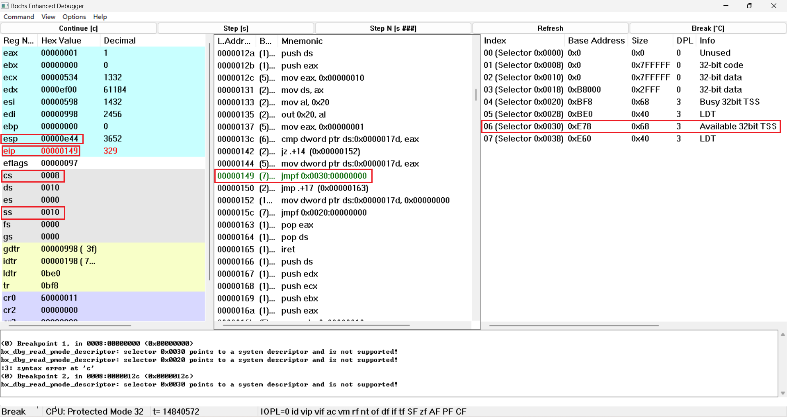
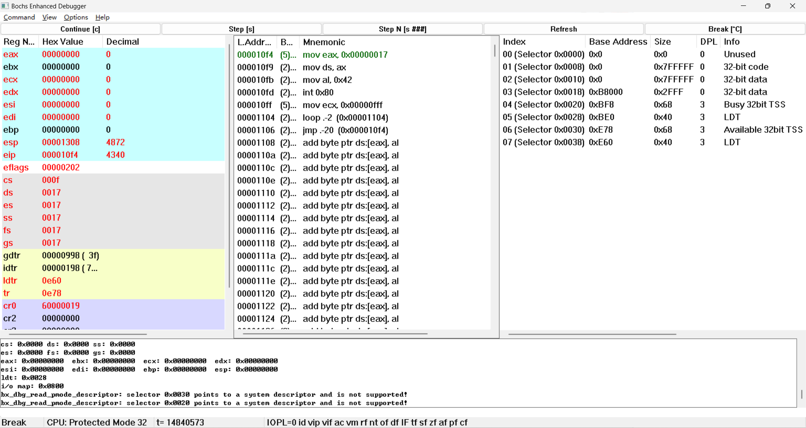
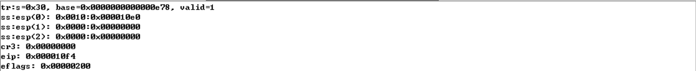
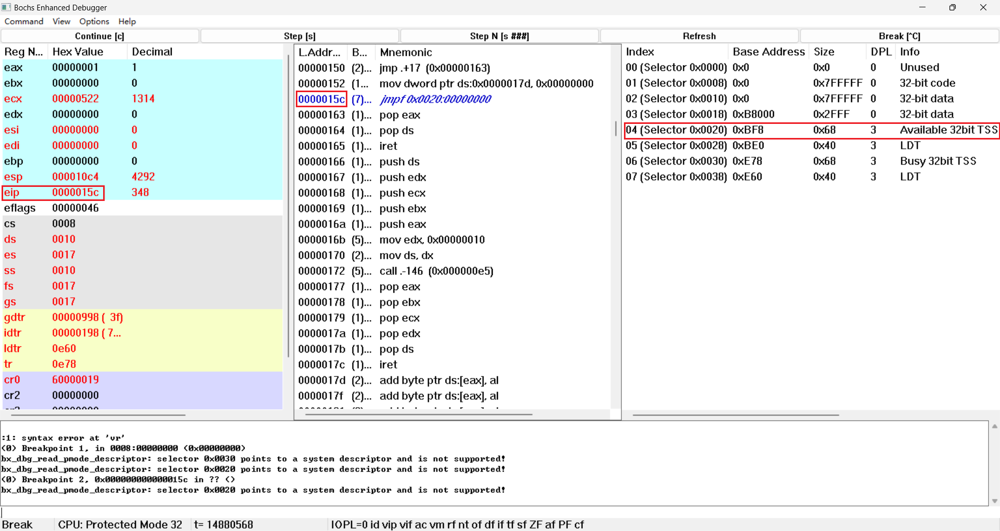
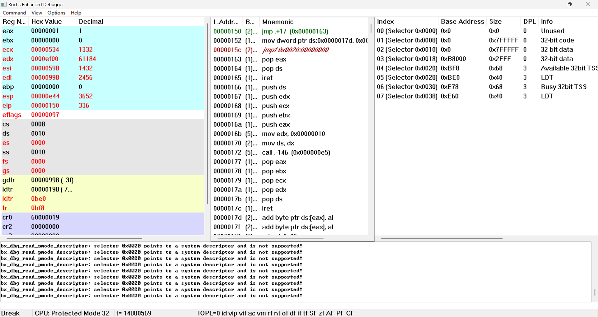

# 实验二 调试分析 Linux 0.00 多任务切换

## 1.当执行完 `system_interrupt` 函数，执行 `153` 行 `iret` 时，记录栈的变化情况。

​		

​		将`iret`地址设为断点，执行到`iret`前，现在栈顶SS:ESP指向0x10:0x0E4C，并且可以看见内核栈栈顶的中断返回地址0x0F:0x10EB 和用户栈栈顶地址0x17:0x0BD8：

​      执行 `153` 行 `iret` 后，栈顶SS:ESP被切换到了0x17:0x0BD8，并且中断返回到了0x0F:0x10EB处。
	栈指针（ESP）会增加 12 个字节，指向栈顶。

## 2.当进入和退出 `system_interrupt` 时，都发生了模式切换，请总结模式切换时，特权级是如何改变的？栈切换吗？如何进行切换的？

​      当进入 system_interrupt 时，由于用户态程序使用 int 0x80 指令调用系统服务，因此发生了从用户态（特权级3）到内核态（特权级0）的模式切换。

​      这时，CPU 会自动从 TSS 中加载内核态的 SS 和 ESP，并压入用户态的 SS、ESP、EFLAGS、CS 和 EIP 到内核栈中。

​      因此，栈也发生了切换，从用户栈切换到内核栈。

​      当退出 system_interrupt 时，由于内核态程序使用 iret 指令返回用户态程序，因此发生了从内核态（特权级0）到用户态（特权级3）的模式切换。

​      这时，CPU 会自动从内核栈中弹出用户态的 EIP、CS、EFLAGS、ESP 和 SS，并加载到相应的寄存器中。

​      因此，栈也发生了切换，从内核栈切换到用户栈。

## 3.当时钟中断发生，进入到 `timer_interrupt` 程序，请详细记录从任务 `0` 切换到任务 `1` 的过程。

​		

时钟中断处理程序`timer_interrupt`的入口地址0x0000012C处的指令“mov eax,0x00000010”处插入断点，执行至此条指令之前。
​		
此时第一次执行的任务0已经打印出了几个A，但是任务1还未执行过，还没有打印出来B：

之后逐步运行到处理器将要执行位于0x08:0x0149处的远转移指令“jmpf 0x30:0”。这条远转移指令意图将一个TSS 选择子装入CS。这条指令的选择子是0x30，GDT表中0x30是一个还未执行的TSS选择子。
​
输入调试命令“info tss”，看一下任务切换前的TSS：

​执行之后寄存器变化：

​		现在已经切换到任务1，由于任务1是第一次执行，直接跳转到了用户程序task1的入口处。可以发现相比于前面，各个寄存器的值发生了很大变化。然后再查看现在的TSS：

​		TSS发生了改变，并且现在各个寄存器的值和TSS里的各个字段是一致的，任务切换时会根据TSS的各个字段修改寄存器。

## 4.又过了 `10ms` ，从任务`1`切换回到任务 `0` ，整个流程是怎样的？ `TSS` 是如何变化的？各个寄存器的值是如何变化的？

​		在时钟中断处理程序入口处设置断点，运行到下一次时钟中断发生为止。查看GDT，0x20是另一个TSS选择子。

​		查看当前的TSS：

​		第二次任务切换后，由于第一次任务切换时将寄存器现场保存到了TSS0里，因此将TSS0切换回来后，CS:EIP 会指向第一次任务切换的下一条地址，也就是0x08:0x0150。

​		查看当前TSS，显示CS:EIP确实是0x08:0x0150。

## 5.请详细总结任务切换的过程。

任务切换的流程如下：

1. 首先通过压入需要的EFLAGS/CS/EIP/SS/ESP入栈并通过返回操作进入用户模式使程序进入任务0开始执行。

2. 当任务0执行到loop指令的时候产生时钟中断，任务0将当前的EFLAGS/CS/EIP/SS/ESP压入任务0的内核栈中作为返回的位置，然后进入时钟中断处理程序，在程序内会检查current获得当前执行的任务的序号，检查到当前任务序号为0的时候就将current变量修改为1，并通过ljmp（jmpf）指令跳转到任务1开始执行，在执行的时候会将当前的寄存器状态存入TSS0中，并将TSS1中的寄存器状态读入当前的寄存器，在最开始的时候都会初始化为0。

3. 初始状态下进入任务1之后，是从头开始执行，当开始执行到loop指令的时候发生时钟中断，此时又返回中断处理程序，此时和任务0的执行方式相似，将current变量修改为0之后再跳转回任务0继续执行。

4. 和之前的跳转不同的是这次跳转之后会在上一次执行的语句之后继续执行，任务0此时仍旧在执行中断处理程序，所以在jumpf语句之后继续执行并执行中断返回，内核栈的前5项进行弹栈操作，恢复到用户模式继续执行任务0的loop语句，然后等到下一次loop语句执行的时候再次进入中断处理程序，同样通过先修改current变量的方式进行跳转操作，跳转到任务1继续执行。

5. 任务1此时重新加载TSS1，在之前的jumpf语句之后继续顺序执行，通过iret弹栈返回用户模式继续执行任务1的loop语句，直到下一次的loop语句产生时钟中断回到中断处理程序，再将current变量修改为0，再次出现跳转操作，回到步骤4。然后语句将在步骤4和步骤5之间循环执行。

