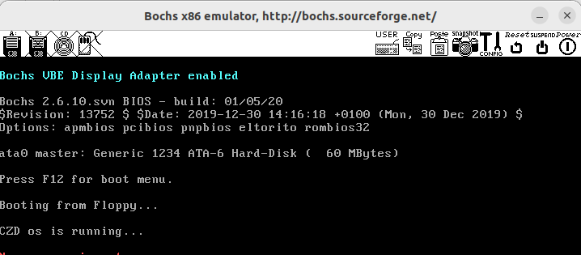
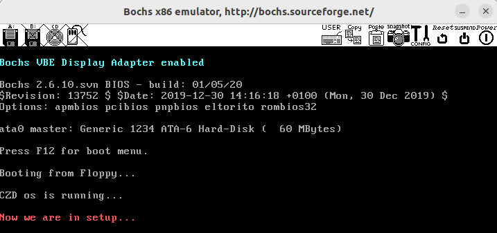
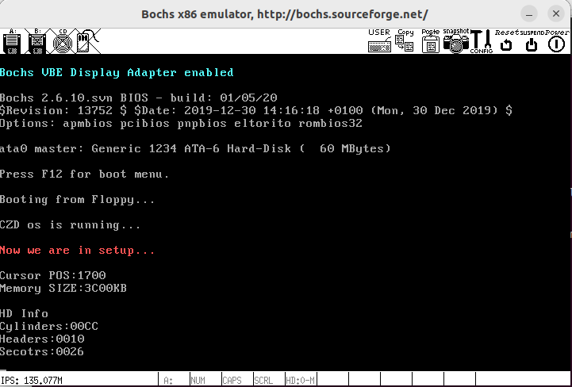

# 实验三——操作系统的引导

## 1. 改写 `bootsect.s` 主要完成如下功能：

`bootsect.s` 能在屏幕上打印一段提示信息

```
XXX is booting...
```

首先修改`bootsect.s`中`msg1`中打印的内容：

```assembly
msg1:
	.byte 13,10
	.ascii "CZD os is running..."
	.byte 13,10,13,10
```

再找到调用`print` `msg1`时的代码，修改打印内容的长度为`#25`：

```assembly
! Print some inane message

	mov	ah,#0x03		! read cursor pos
	xor	bh,bh
	int	0x10
	
	mov	cx,#25
	mov	bx,#0x0007		! page 0, attribute 7 (normal)
	mov	bp,#msg1
	mov	ax,#0x1301		! write string, move cursor
	int	0x10
```

之后在`Linux0.11/`下编译为Image文件后`run`，结果为：



## 2. 改写 `setup.s` 主要完成如下功能：

1. `bootsect.s` 能完成 `setup.s` 的载入，并跳转到 `setup.s` 开始地址执行。而 `setup.s` 向屏幕输出一行

```
Now we are in SETUP
```

2. `setup.s` 能获取至少一个基本的硬件参数（如内存参数、显卡参数、硬盘参数等）， 将其存放在内存的特定地址，并输出到屏幕上。`setup.s` 不再加载Linux内核，保持上述信息显示在屏幕上即可。

参照着`bootsect.s`中输出文字的代码改写`setup.s`，在开始时修改`es`的值为`cs`

```assembly
entry _start
_start:
	mov	ax,cs
	mov	ds,ax
	mov	es,ax

	mov	ah,#0x03		! read cursor pos
	xor	bh,bh
	int	0x10
	
	mov	cx,#28
	mov	bx,#0x000c		! page 0, attribute c 
	mov	bp,#msg1
	mov	ax,#0x1301		! write string, move cursor
	int	0x10
msg1:
	.byte 13,10
	.ascii "Now we are in setup..."
	.byte 13,10,13,10
```

为了继续使用`make`编译，改造 `build.c` 。当 `argv[3]` 是 `none` 的时候， 只写 `bootsect` 和 `setup` ，忽略所有与 `system` 有关的工作，或者在该写 `system` 的位置都写上 `0` 。这里找到`build.c`的第178行，改为直接返回即可。

```c
	if (strcmp(argv[3],"none") == 0)
		return 0;
```

使用`make BootImage`编译后`run`，结果为：



#### 改写`setup.s`输出硬件参数

按照实验手册上的提示写出打印16位数的汇编过程，使用`call`指令来调用。将打印的数放在`dx`寄存器中：

```assembly
!以16进制方式打印栈顶的16位数
print_hex:
    mov    cx,#4         ! 4个十六进制数字
    mov    dx,(bp)       ! 将(bp)所指的值放入dx中，如果bp是指向栈顶的话
print_digit:
    rol    dx,#4         ! 循环以使低4比特用上 !! 取dx的高4比特移到低4比特处。
    mov    ax,#0xe0f     ! ah = 请求的功能值，al = 半字节(4个比特)掩码。
    and    al,dl         ! 取dl的低4比特值。
    add    al,#0x30      ! 给al数字加上十六进制0x30
    cmp    al,#0x3a
    jl     outp          ! 是一个不大于十的数字
    add    al,#0x07      ! 是a～f，要多加7
outp:
    int    0x10
    loop   print_digit
    ret
```

同时将打印文字提示信息的代码也封装成一个过程：

```assembly
!打印bp中指定的message，cx中应该存放字符数
print_msg:
	mov bx, #0x0007
	mov ax, #0x1301
	int 0x10
	ret
```

将硬件参数取出来放在内存 `0x90000` 的关键代码:

```assembly
!读入光标位置
	mov ax, #INITSEG
	mov ds, ax
	mov ah, #0x03 !功能号0x03表示读光标
	xor bh, bh
	int 0x10
	mov [0], dx !将dx中保存的光标位置保存到ds:0中
	!打印光标位置
	mov cx, #14
	mov bp, #msg2
	call print_msg
	call print_hex
	call print_nl
	!读入内存大小
	mov ah, #0x88
	int 0x15
	mov [2], ax
    !打印扩展内存大小
	mov cx, #15
	mov bp, #msg3
	call print_msg
	mov dx, [2]
	call print_hex
	call print_nl

	!从0x41处拷贝16个字节（第一个磁盘参数表）
	mov ax, #0x000
	mov ds, ax
	lds si, [4*0x41] !第一个磁盘参数表的入口地址
	mov ax, #INITSEG
	mov es, ax
	mov di, #0x0004 !从es:0x0004处开始存储
	mov cx, #0x10
	rep
	movsb
```

编译后运行`run`的结果：



查看`bochs/bochsrc.bxrc`文件，打印的信息是一致的（该文件显示的是十进制）


## 		3.请找出 `x86` 计算机启动过程中，被硬件强制，软件必须遵守的两个“多此一举”的步骤（多找几个也无妨），说说它们为什么多此一举，并设计更简洁的替代方案。

1. BIOS（Basic Input/Output System）会在计算机启动时，将自己的代码复制到内存中，并将控制权交给这段代码。这段代码会检查计算机的硬件配置，然后寻找一个可引导的设备（通常是硬盘），并从该设备的第一个扇区读取引导程序。这个扇区通常被称为主引导记录（MBR）。但是，由于历史原因，MBR 的最后两个字节必须是 0x55 和 0xAA。这两个字节没有任何实际意义，只是为了让 BIOS 确信这确实是一个可引导的设备。
2. 引导程序会将自己的代码复制到内存中，并将控制权交给这段代码。这段代码会检查分区表，然后寻找一个可引导的分区，并从该分区的第一个扇区读取操作系统内核。但是，由于历史原因，分区表的最后两个字节必须是 0x55 和 0xAA。这两个字节没有任何实际意义，只是为了让引导程序确信这确实是一个可引导的分区。

3. CPU 在上电后，被硬件设置为实模式，并且 CS:IP 指向 0xFFFFFFF0 处，这个地址是 BIOS ROM 的最后 16 个字节，只能放一条跳转指令，跳转到 BIOS ROM 的其他地方执行。这个步骤是为了向下兼容 8086 处理器，但是对于现代的 32 位或 64 位处理器来说，是没有必要的，而且增加了启动的时间和复杂度。一个更简洁的替代方案是，让 CPU 在上电后，直接进入保护模式或长模式，并且 CS:IP 指向 BIOS ROM 的起始地址，从而省去了跳转的步骤。

4. BIOS 在完成自检和初始化后，会从引导设备的第一个扇区（MBR）读取 512 字节的引导代码，加载到内存的 0x7C00 处，并跳转到那里执行。这个步骤是为了遵循 MBR 分区表的规范，但是对于现代的操作系统来说，512 字节的空间太小了，无法放下足够的引导代码，而且 MBR 分区表也有很多限制，例如最多只能有四个主分区，最大只能支持 2TB 的磁盘。一个更简洁的替代方案是，使用 GPT 分区表，它可以支持更多的分区，更大的磁盘，而且有一个专门的 EFI 系统分区，用来存放引导加载器，不受 512 字节的限制。